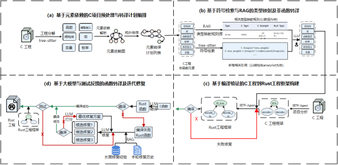
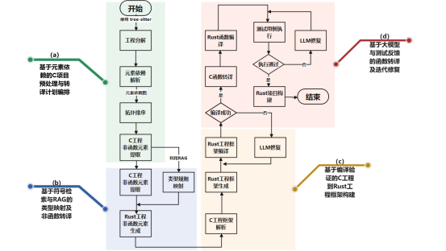

# MinsC2Rust：面向工程级的 C→Rust 自动转译工具

## 项目名称
MinsC2Rust 是一个以大型语言模型为核心的工程级自动化转译方案，旨在帮助系统软件从庞大的 C/C++ 代码基快速、可靠地迁移到 Rust。随着 Firefox、Linux 等项目逐步引入 Rust，业界迫切需要能兼顾准确性与效率的自动化转译工具，以减轻手工重写的巨大成本。

传统工具（如 c2rust）倾向生成 C 风格的 Rust 代码，无法处理外部依赖，且初次转译后约 90%-95% 的代码仍需人工介入才能满足 Rust 安全约束。同时，LLAMA-7B/13B、GPT-3.5 等大模型在面对 Rust 语料稀缺、上下文窗口有限、内存模型差异显著的场景时，常出现编译不过、语义偏差等问题。LLMs 在翻译真实工程时频繁引入 bugs，复杂程序甚至难以编译通过。

MinsC2Rust 设计为多阶段流水线：先通过工程分解与依赖解析保障处理顺序，再结合类型映射规则与 LLM 转译非函数元素，随后利用 SWE-Agent 构建并修复 Rust 工程框架，最终在函数层面引入 LLM 转译与迭代测试修复。该流程在兼顾工程结构、类型适配与编译反馈的前提下，提高了大规模 C→Rust 转译的可靠性与可维护性。

## 运行条件
- **Docker 环境**：安装 Docker Engine。项目依赖已封装在根目录 `Dockerfile` 与配套的 `requirements.txt` 中。
- **镜像构建**：在仓库根目录执行 `./scripts/docker_build.sh`，生成包含完整依赖的运行环境。
- **容器入口**：调用 `./scripts/docker_run.sh`启动交互式容器，会自动挂载当前仓库到 `/app` 目录，便于在容器内执行后续命令。

## 运行说明
### 步骤 1：准备配置
复制并按需修改 `analyzer_config.yaml` ，补充工程入口、依赖路径等信息（`llm/ENV.py` 中需写入有效的 API Key）。

### 步骤 2：进入容器并启动流水线
在宿主机执行 `./run_docker.sh` 进入容器后，运行 `./run.sh analyzer_config.yaml`，触发工程解析、类型映射、框架生成、函数转译与编译验证的全流程。默认日志会保存到 `logs/` 目录（如 `logs/run-<时间>.log`），便于追踪转译状态。

### 步骤 3：检查结果
完成后在容器内或宿主机查看  `output` 目录，核对生成的 Rust 工程、编译日志与错误反馈，根据提示定位并修复潜在的语义或依赖问题。

## 测试说明
项目已在 `benchmarks/c-algorithm`、`benchmarks/crown`、`benchmarks/test` 与 `benchmarks/translate_chibicc` 等数据集完成验证，可生成编译通过的 Rust 工程；

## 技术架构
项目分为四个关键子模块：

- **基于元素依赖的预处理与计划编排**：通过工程分解提取核心代码元素，解析元素间依赖关系构建依赖图，并结合拓扑排序生成有序转译计划，解决 C 项目依赖复杂、转译顺序混乱的问题。
- **基于符号检索与 RAG 的类型映射**：利用符号检索获取非函数元素（结构体、宏、枚举等）的全局引用信息，结合 RAG 检索类型映射规则库实现 C→Rust 类型适配，并通过 LLM 生成符合 Rust 规范的非函数元素。
- **基于编译验证的工程框架构建**：分析 C 工程的模块划分与文件依赖，生成匹配的 Rust 工程框架（含模块文件与函数声明占位），通过 Cargo 编译验证并修复框架错误，确保工程结构与原项目功能对齐。
- **基于大模型与测试反馈的函数迭代转译**：在 Rust 工程架构与已转译函数上下文中，调用 LLM 进行函数转译；若编译或测试失败，则将反馈输入 LLM 迭代修复，直至通过验证，确保函数逻辑正确性与可执行性。

## 工作流程
项目采用“工程分解 → 类型映射 → 框架构建 → 函数转译 → 编译测试”五阶段流水线：

- **工程分解**：借助 tree-sitter 抽取函数、结构体、宏等核心元素，构建元素依赖图并进行拓扑排序，生成有序的转译计划。
- **类型映射**：通过符号检索与 RAG 规则库匹配数组、指针、宏等 20+ 类型映射策略，指导 LLM 输出符合 Rust 语法与工程上下文的非函数元素。
- **框架构建**：自动生成对应的 Rust 模块、Cargo 清单与占位函数，结合 Cargo 编译反馈完成工程框架修复，保持模块间调用关系与原 C 工程一致。
- **函数转译**：在框架上下文中调用 LLM 转译函数实现，结合历史经验库、多候选与编译验证流程迭代修复编译错误。
- **编译测试**：优先复用原 C 工程测试用例，缺失测试的项目暂以编译验证为主，后续将扩展自动化测试生成与比对机制。

## 优化与改进方向

### 非函数元素转译优化
- **基线方案**：直接将 C 非函数元素交由 LLM 转译，缺乏类型系统适配与全局上下文，易发生类型误译与宏语义缺失。
- **当前方案**：采用“符号检索 + RAG 规则匹配 + LLM 生成”三层策略，为结构体、宏、枚举等元素提供精准的类型映射与语义保障。
- **优化效果**：显著降低类型适配错误率，提升宏语义保真度与编译通过率，为后续函数转译奠定正确的类型基础。

### 函数编译修复优化
- **基线方案**：单次生成并基于编译报错重试，缺乏经验积累与候选筛选，导致修复效率低且易重复无效尝试。
- **当前方案**：构建编译错误经验库，结合多候选生成与 Cargo 验证筛选机制，并记录失败历史避免重复尝试。
- **优化效果**：编译错误修复成功率显著提升，复杂所有权与生命周期问题的处理更加高效，降低转译中断概率。

### 测试验证未来规划
- **当前缺陷**：对于无自带测试用例的工程（如 `translate_chibicc`、`translate_littlefs_fuse`），目前只能通过编译验证，存在语义偏差风险；既有测试亦缺乏边界场景覆盖。
- **预期方案**：计划实现“C 测试用例生成 → Rust 测试同步转译 → 全场景验证反馈”三步闭环，以提升功能验证覆盖率并捕获边界错误。

## 后续改进方向
- 扩展自动化测试生成体系，实现从编译验证到功能验证的闭环。
- 引入多线程并行策略，加速工程分解与函数转译流水线，提升整体吞吐量与稳定性。
- 持续丰富非函数元素规则库与编译错误经验库，重点提升 `benchmarks/translate_littlefs_fuse` 等复杂数据集的转译可靠性。