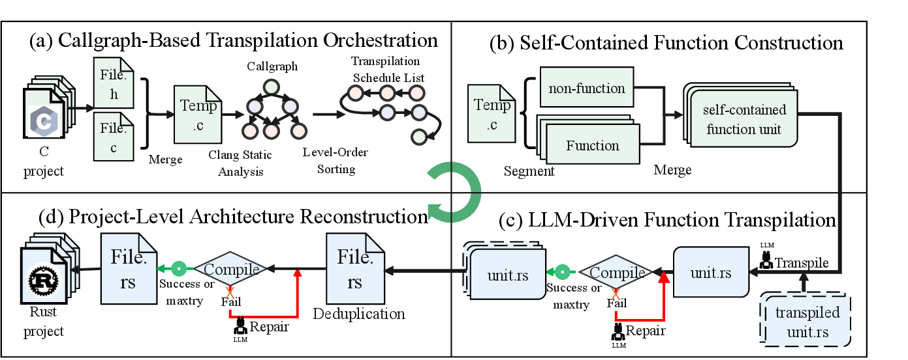

# MinsC2Rust

Code release for **MinsC2Rust: LLM-Driven Project-Level Code Migration from C to Safe Rust**.

MinsC2Rust is a project-level C-to-Rust migration framework. It follows a
**divide-transpile-reconstruct** workflow: analyze dependencies in a C project,
build self-contained function units, transpile them with LLM and compiler
feedback, and reconstruct a Rust project that preserves the original file
organization and inter-function call relations.

Paper: [MinsC2Rust: LLM-driven project-level code migration from C to safe Rust](https://doi.org/10.1007/s10664-026-10905-4)

Artifact DOI: [10.5281/zenodo.17651630](https://doi.org/10.5281/zenodo.17651630)

Chinese documentation is available in [README_zh.md](README_zh.md).

## Framework



MinsC2Rust consists of four components:

1. **CBTO: Callgraph-Based Transpilation Orchestration**
   Builds a function call graph and schedules functions in dependency-aware order.
2. **SCFC: Self-Contained Function Construction**
   Builds function units that include the function body plus required non-function elements such as types, macros, and globals.
3. **LDFT: LLM-Driven Function Transpilation**
   Transpiles function units with nearby Rust dependencies and repairs compilation failures using compiler feedback.
4. **PLAR: Project-Level Architecture Reconstruction**
   Deduplicates generated Rust code and reconstructs a complete Rust project.

## Repository Layout

```text
.
├── Tool/                  # Main C-to-Rust migration pipeline
├── cc_mini/               # Runtime/test repair agent
├── configs/               # Example runtime configs
├── benchmarks/            # Public C benchmarks
│   ├── arraylist/         # Small smoke benchmark
│   ├── c-algorithm/       # Larger data-structure benchmark
│   └── crown/Input/       # Curated Crown benchmark subset
├── scripts/               # Convenience scripts
├── assets/                # README figures
├── .cc-mini.example.toml  # CC-MINI config template
└── README.md
```

Generated results are written to `Output/`, which is ignored by Git.

## Installation

Tested environment:

- Python 3.12
- Rust stable and Cargo
- Clang / libclang
- CMake and basic C build tools
- Graphviz and universal-ctags
- An OpenAI-compatible LLM endpoint

Ubuntu/Debian example:

```bash
sudo apt-get update
sudo apt-get install -y git build-essential cmake clang libclang-dev graphviz universal-ctags

curl --proto '=https' --tlsv1.2 -sSf https://sh.rustup.rs | sh
source "$HOME/.cargo/env"
rustup default stable
rustup component add rustfmt
```

Python environment:

```bash
git clone https://github.com/Kangzhezhe/MinsC2Rust.git
cd MinsC2Rust

curl -LsSf https://astral.sh/uv/install.sh | sh
uv venv --python 3.12
source .venv/bin/activate
uv pip install -r Tool/requirements.txt
```

## Configuration

MinsC2Rust uses two local configuration files. Both are ignored by Git.

### Main Translation Model

```bash
cp configs/config.example.ini configs/config.ini
```

Edit `configs/config.ini`:

```ini
[LLM_API_Keys]
openai_url = https://your-openai-compatible-endpoint/v1
openai_api_key = YOUR_TOOL_API_KEY
openai_model = your-model-name
```

### CC-MINI Runtime Repair Agent

```bash
cp .cc-mini.example.toml .cc-mini.toml
```

Edit `.cc-mini.toml`:

```toml
provider = "openai"
stream = false

[openai]
api_key = "YOUR_CC_MINI_API_KEY"
base_url = "https://your-openai-compatible-endpoint/v1"
model = "your-model-name"
use_finish_tool = true
```

The main translation model and the CC-MINI agent can use different providers,
keys, base URLs, and models.

## Quick Start

Run the small `arraylist` smoke benchmark:

```bash
./scripts/smoke_test.sh
```

Important output:

```text
Output/arraylist_smoke_current/
├── Output/
│   ├── results.json
│   ├── all_error_funcs_content.json
│   ├── report.md
│   ├── logs/
│   └── state/
└── tmp/
```

Start with `Output/arraylist_smoke_current/Output/report.md` when inspecting a
run.

## Larger Benchmarks

After setting `configs/config.ini` and `.cc-mini.toml`, run:

```bash
cd Tool
./run.sh ../configs/config_c_algorithm.ini
./run.sh ../configs/config_crown.ini
```

These benchmarks are larger than the smoke test and may require more LLM calls
and repair rounds.

## Reproducing Paper-Style Experiments

The public repository contains the core pipeline and public benchmarks. The
paper reports results on C-Algorithm and Crown, including:

- 98.4% compilation success
- 42.6% execution correctness
- 100.0% safe lines-of-code coverage
- 95.8% safe reference ratio

Because the pipeline uses LLMs, exact outputs may vary across providers, model
versions, and API stability. The current release is intended to make the
workflow executable and inspectable; paper-level archived artifacts are linked
through the artifact DOI above.

For the included `arraylist` smoke benchmark, enabling source-level runtime
repair with the CC-MINI agent can produce a fully passing exported Rust project:
the reproducibility check runs `cargo test --quiet` on the reconstructed project
and expects all tests to pass. This smoke result is a practical end-to-end check
of the public pipeline, not a replacement for the paper-level benchmark results
above.

## Notes

- MinsC2Rust targets project-level migration rather than isolated snippet translation.
- The current workflow is static-first: it prioritizes compiler-guided buildability and safety.
- Runtime tests and CC-MINI repair are used as practical validation and repair aids, not as formal semantic proof.
- Generated Rust may remain C-shaped in places; idiomatic Rustification is a separate step.

## Citation

If you use MinsC2Rust in research, please cite the paper:

```bibtex
@article{kang2026minsc2rust,
  title   = {MinsC2Rust: LLM-driven project-level code migration from C to safe Rust},
  author  = {Kang, Zhehao and Zhu, Qianyu and Mou, Wenrui and Wang, Bang and Zhang, Xiaogang and Huang, Haojun},
  journal = {Empirical Software Engineering},
  year    = {2026},
  doi     = {10.1007/s10664-026-10905-4},
  url     = {https://doi.org/10.1007/s10664-026-10905-4}
}
```

Please also cite the released artifact when referring to this code package:

```bibtex
@software{kang2026minsc2rust_artifact,
  title  = {MinsC2Rust: LLM-Driven Project-Level Code Migration from C to Safe Rust},
  author = {Kang, Zhehao and Zhu, Qianyu and Mou, Wenrui and Wang, Bang and Zhang, Xiaogang and Huang, Haojun},
  year   = {2026},
  doi    = {10.5281/zenodo.17651630},
  url    = {https://doi.org/10.5281/zenodo.17651630}
}
```

## License

See [LICENSE](LICENSE).
